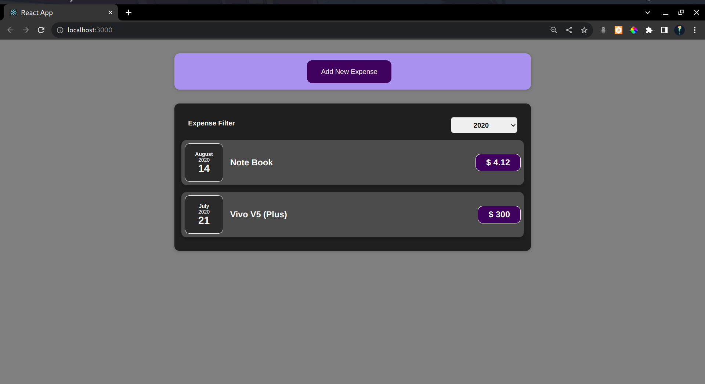
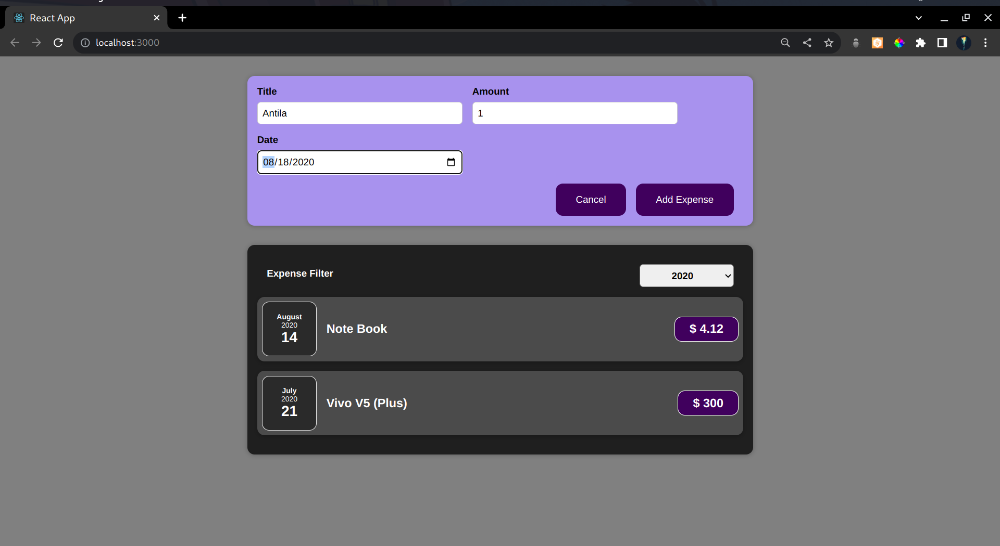
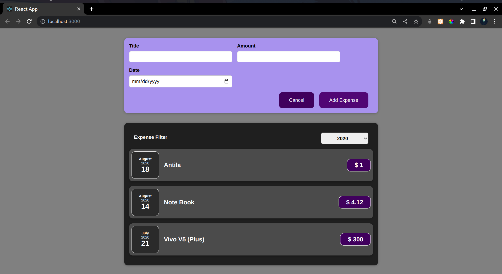
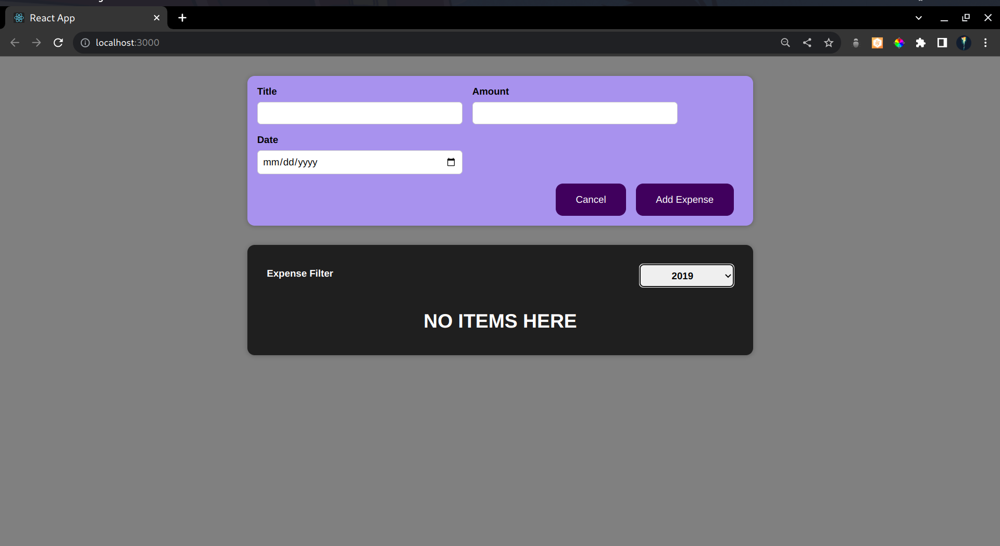

# React-Expense-Tracker
Expense Tracker In React

- To start this app you should have node js installed 

- After installing Nodejs go this file and start you cmd/terminal here and type command `npm install`

- After all the dependencies are installed type `npm start` then go to `http://localhost:3000/` in your browser

